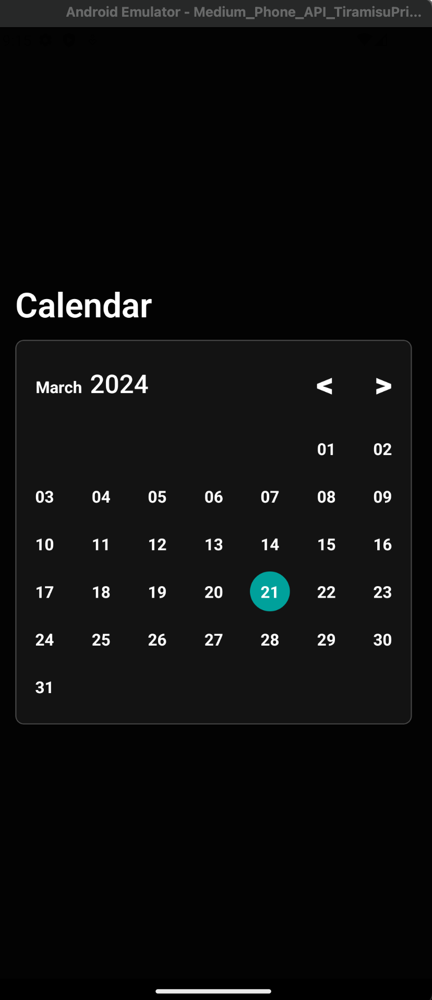
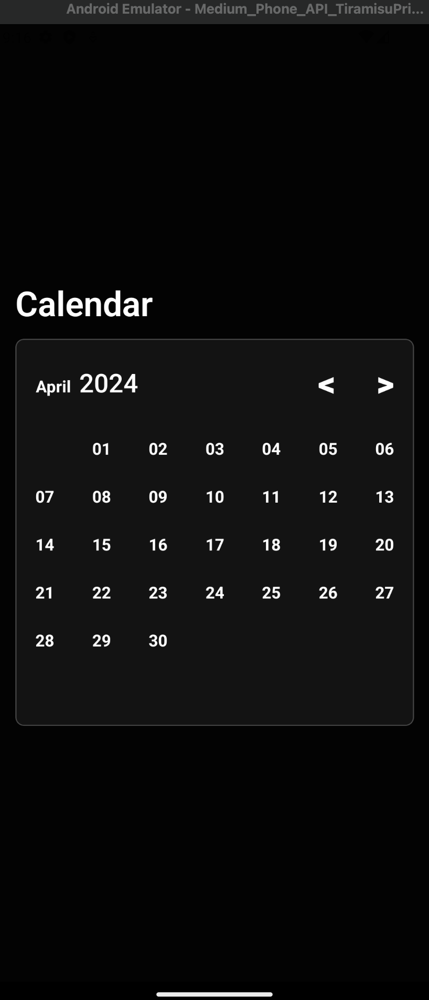
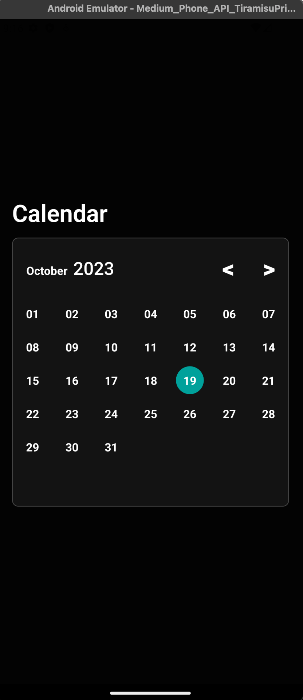

# Calendar With Expo

## Project Description

This project is a simple calendar application built with Expo from scratch with no libraries. You can pick a day from any month of any year.

## Screenshots

  
  
  

